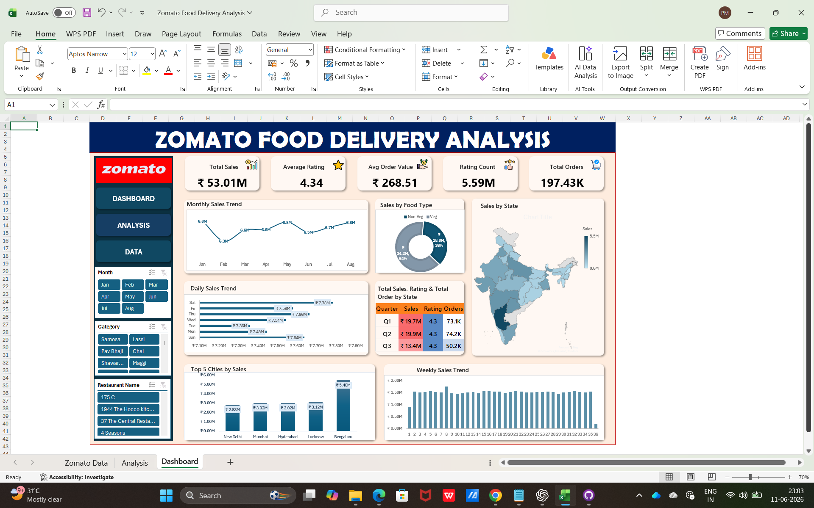
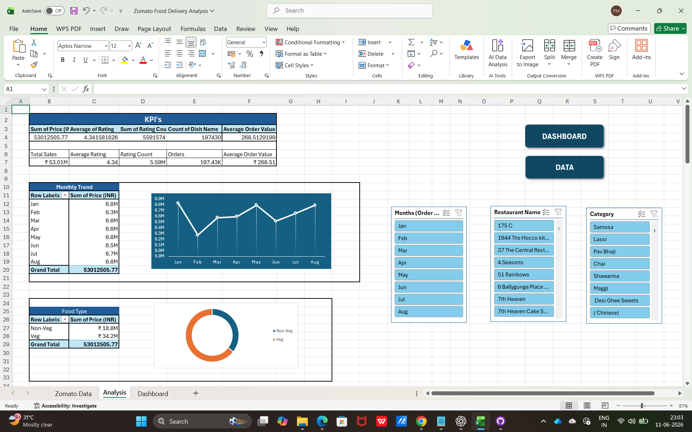
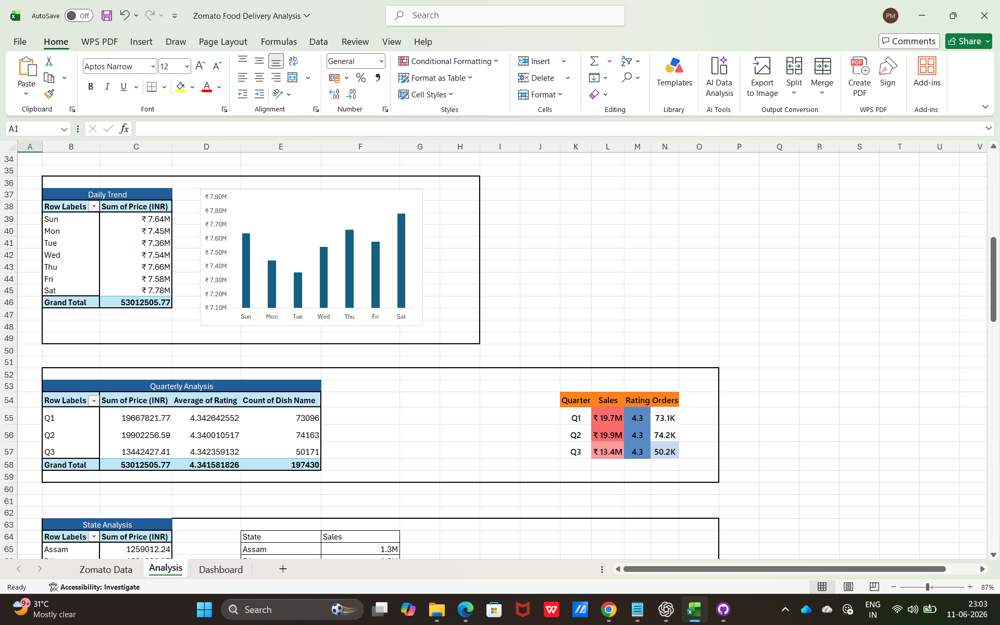
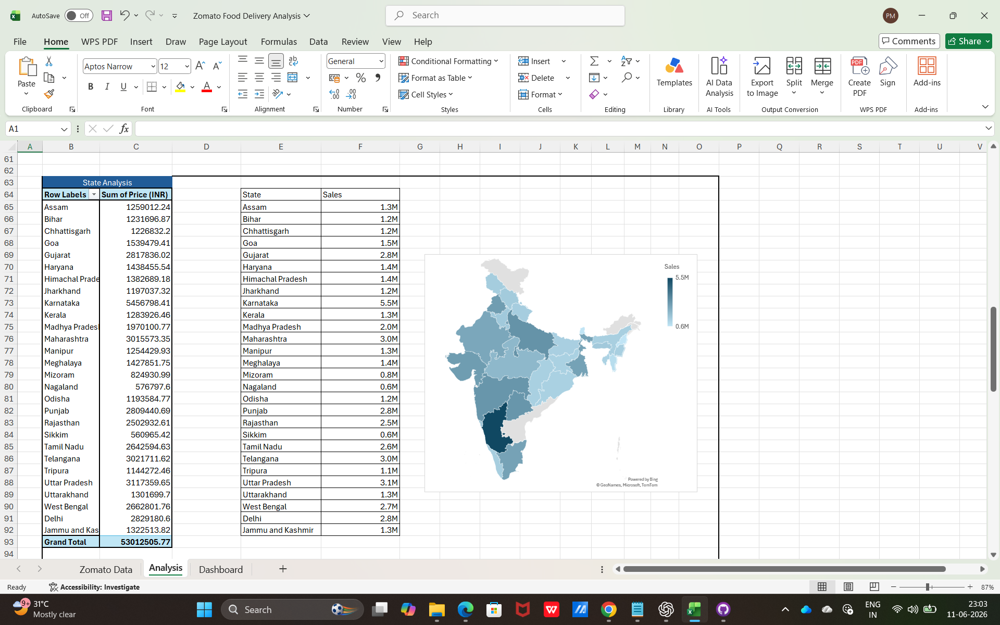
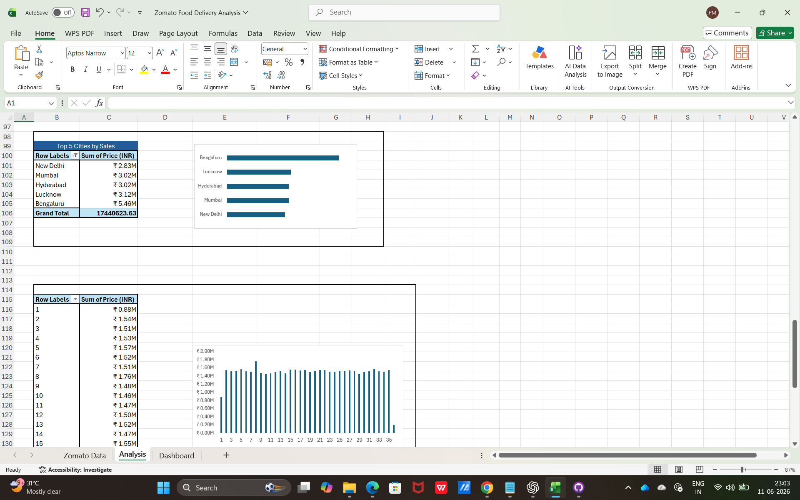
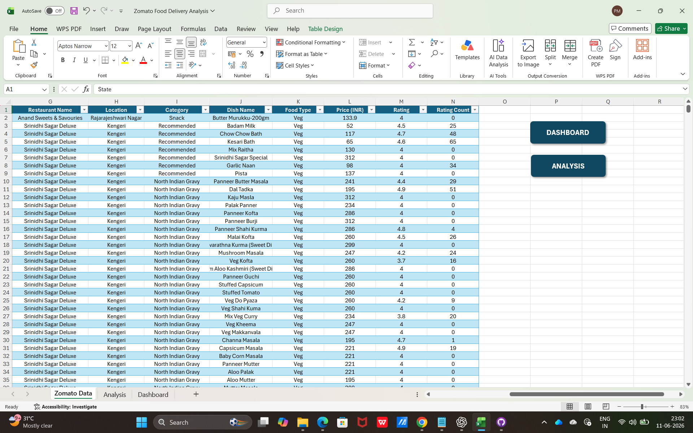

# 🍽️ Zomato Food Delivery Analysis Dashboard

## 📌 Project Overview

This project is an interactive Excel Dashboard created to analyze Zomato food delivery data. It provides insights into restaurant performance, customer ratings, delivery trends, cuisines, and city-wise analysis through dynamic charts and KPIs.

---

## 🛠 Tools Used

* Microsoft Excel
* Pivot Tables
* Pivot Charts
* Slicers
* Conditional Formatting
* Data Cleaning

---

## 📊 Dashboard Features

* Interactive Dashboard
* KPI Cards
* City-wise Analysis
* Restaurant Analysis
* Cuisine Analysis
* Delivery Trend Analysis
* Dynamic Filters

---

## 📈 Key KPIs

* Total Restaurants
* Total Orders
* Average Rating
* Average Cost
* Online Delivery Availability
* Table Booking Analysis

---

## 🖼 Dashboard Screenshots

### Dashboard

### Analysis

### Data Sheet

---

## 💡 Key Insights

* Identify top-performing restaurants.
* Compare city-wise food delivery trends.
* Analyze customer ratings and preferences.
* Explore cuisine popularity and pricing.
* Interactive slicers enable dynamic filtering.

---

## 📂 Files Included

* Excel Dashboard (.xlsx)
* Dashboard Screenshots
* README Documentation

---

## 👨‍💻 Author

**Prashik Meshram**

Aspiring Data Analyst

**SQL | Python | Power BI | Tableau | Excel**
